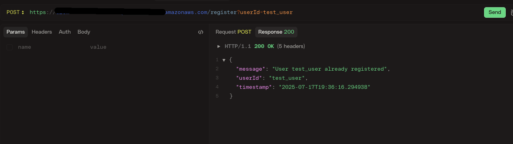
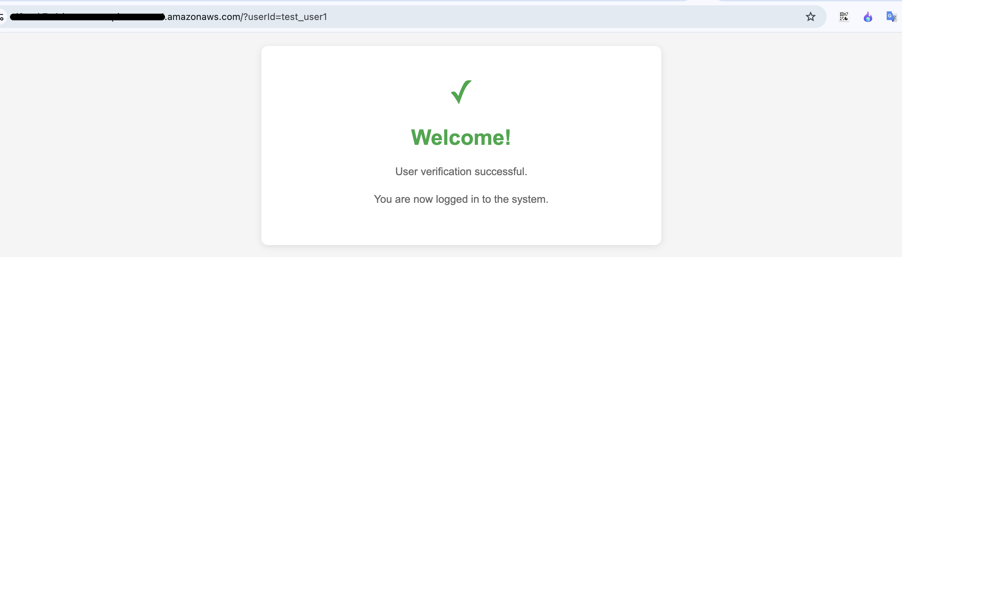
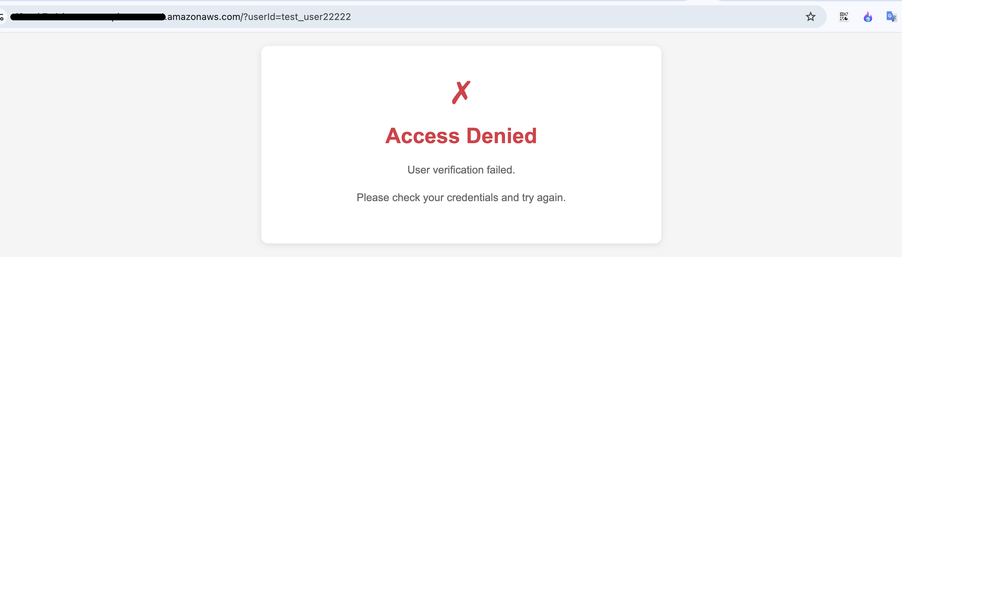

# Infra as Code - Assignment Solution

## Overview
This repository contains a Terraform-based solution for the IaC course assignment, implementing a serverless AWS architecture with API Gateway, Lambda, DynamoDB, and S3 for static website hosting.

---

## Quick Start for Instructors

### 1. **Clone the Repository**
```bash
git clone <your-repo-url>
cd <repo-directory>
```

### 2. **Set Up AWS Credentials**
- Use the provided AWS Beach account credentials (see BEACH.md).
- Ensure your AWS CLI is configured:
  ```bash
  aws configure
  ```

### 3. **Deploy the Infrastructure**
- Run the deployment script (from project root):
  ```bash
  ./scripts/deployment/deploy.sh
  ```
- This will:
  - Deploy all required AWS resources using Terraform
  - Export all relevant outputs to `infra/infra_outputs.json`

### 4. **Test the Deployed Infrastructure**
- **Automated Tests:**
  ```bash
  ./scripts/test-user-system.sh
  ```
  - This script uses `infra/infra_outputs.json` to test all endpoints and features.
  - All tests should pass if the deployment is correct.

- **Manual Testing:**
  - **API Gateway Register User:**
    ```
    curl -X POST "<API_GATEWAY_URL>/register?userId=testuser"
    ```
  - **API Gateway Verify User:**
    ```
    curl "<API_GATEWAY_URL>/?userId=testuser"
    ```
  - **S3 Static Website:**
    Open the S3 website URL from `infra/infra_outputs.json` in your browser.

- **Where to Find URLs:**
  - All resource URLs (API Gateway, S3, DynamoDB) are in `infra/infra_outputs.json` after deployment.

### 5. **Destroy the Infrastructure**
- Run the destroy script (from project root):
  ```bash
  ./scripts/deployment/destroy.sh
  ```
- This will clean up all AWS resources, including non-empty S3 buckets.

---

## Notes for Instructors
- **No manual AWS Console steps are required.**
- **All tests and scripts are self-contained and require only AWS credentials.**
- **If you fork this repo, update GitHub Actions secrets as per the instructions in `dev_readme.md`.**
- **For troubleshooting, see CloudWatch logs for Lambda and API Gateway.**

---

## Project Structure
- `infra/` - All Terraform code (modularized)
- `src/` - Lambda source code
- `html/` - Static website files
- `scripts/` - Automation scripts (deploy, destroy, test)
- `tests/` - Automated test code

---

## For Developers
See `dev_readme.md` for advanced usage, development, and CI/CD details. 

## Example Screenshots

Below are example screenshots demonstrating the registration and verification flows:

### 1. Registering a User (Already Registered)


### 2. Verifying a Registered User


### 3. Verifying an Unregistered User
 